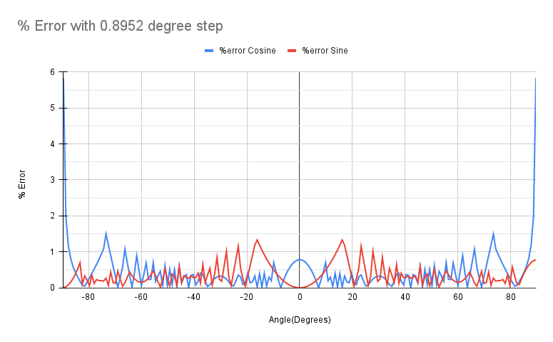

# 8-bit CORDIC Algorithm in Verilog

## Project Overview
This project implements an 8-bit CORDIC algorithm in Verilog to calculate the sine and cosine of an input angle ranging from -90 degrees to +90 degrees.

## Specifications
- **Input:**
  - 8 bits: 1 sign bit, 1 integer bit, and 6 fractional bits
- **Output:**
  - 8 bits: 1 sign bit and 7 fractional bits

## Design Details
- **Algorithm:** CORDIC
- **Operating Frequency:** 100 MHz
- **Latency:** 150 ns

## Tools Used
- **Simulation:** ModelSim
- **Synthesis:** Cadence Genus
- **Place and Route:** Cadence Innovus

## Performance
- **Average Error:**
  - Cosine: 0.45%
  - Sine: 0.36%

  

## Project Files
The repository contains the following files:
- Verilog source code
- Timing analysis reports
- Documentation

## Getting Started
To clone and run this project, use the following commands:
```bash
git clone https://github.com/yourusername/Cordic-8-bit.git
